# Database Architecture Diagrams

Reference diagrams for PostgreSQL, RDS, Aurora, caching, CQRS, Saga, Outbox, and migration patterns.

---

## 1. PgBouncer — Connection Pooling for PostgreSQL

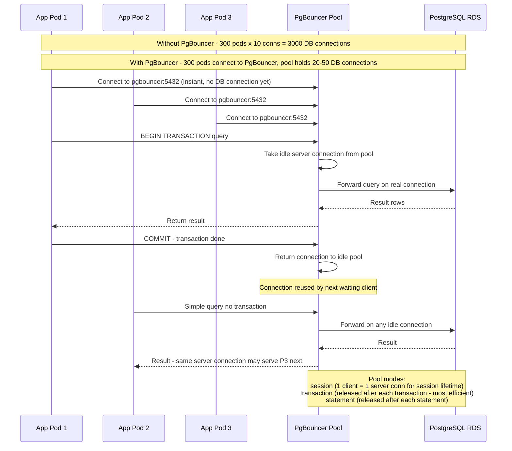
```mermaid
sequenceDiagram
    participant P1 as App Pod 1
    participant P2 as App Pod 2
    participant P3 as App Pod 3
    participant PB as PgBouncer Pool
    participant PG as PostgreSQL RDS

    note over P1,PG: Without PgBouncer - 300 pods x 10 conns = 3000 DB connections

    note over P1,PG: With PgBouncer - 300 pods connect to PgBouncer, pool holds 20-50 DB connections

    P1->>PB: Connect to pgbouncer:5432 (instant, no DB connection yet)
    P2->>PB: Connect to pgbouncer:5432
    P3->>PB: Connect to pgbouncer:5432

    P1->>PB: BEGIN TRANSACTION query
    PB->>PB: Take idle server connection from pool
    PB->>PG: Forward query on real connection
    PG-->>PB: Result rows
    PB-->>P1: Return result

    P1->>PB: COMMIT - transaction done
    PB->>PB: Return connection to idle pool
    note over PB: Connection reused by next waiting client

    P2->>PB: Simple query no transaction
    PB->>PG: Forward on any idle connection
    PG-->>PB: Result
    PB-->>P2: Result - same server connection may serve P3 next

    note over PB,PG: Pool modes:<br/>session (1 client = 1 server conn for session lifetime)<br/>transaction (released after each transaction - most efficient)<br/>statement (released after each statement)
```

---

## 2. RDS Multi-AZ — Automatic Failover

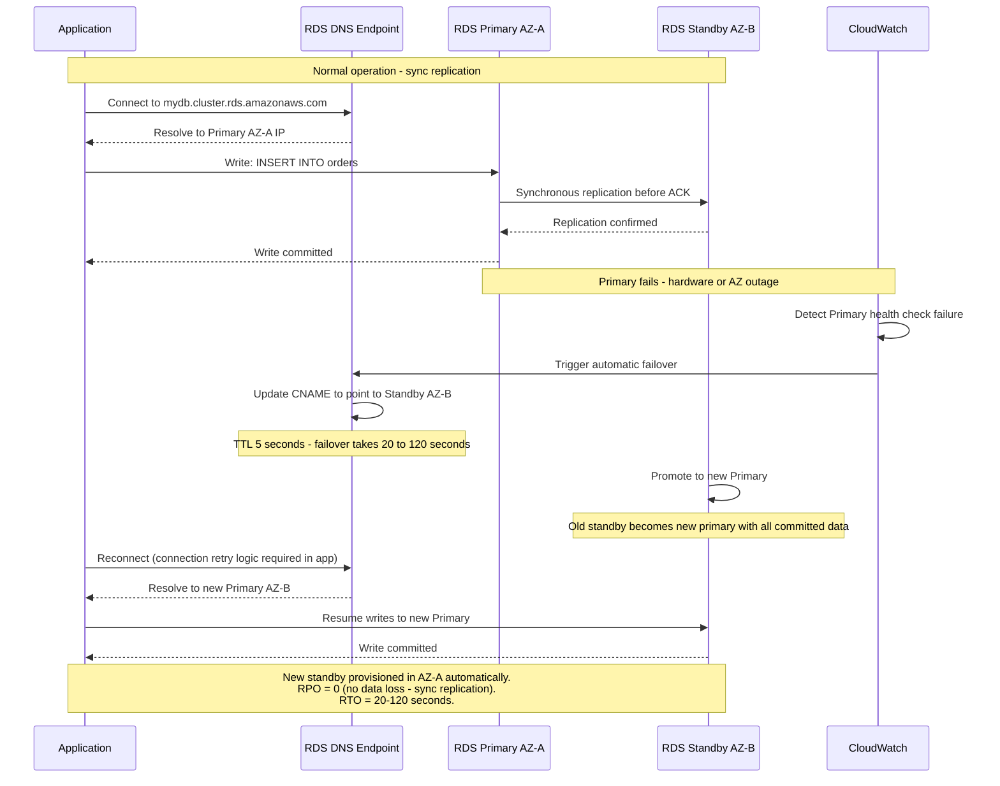
```mermaid
sequenceDiagram
    participant App as Application
    participant DNS as RDS DNS Endpoint
    participant Primary as RDS Primary AZ-A
    participant Standby as RDS Standby AZ-B
    participant CW as CloudWatch

    note over App,Standby: Normal operation - sync replication

    App->>DNS: Connect to mydb.cluster.rds.amazonaws.com
    DNS-->>App: Resolve to Primary AZ-A IP
    App->>Primary: Write: INSERT INTO orders
    Primary->>Standby: Synchronous replication before ACK
    Standby-->>Primary: Replication confirmed
    Primary-->>App: Write committed

    note over Primary,CW: Primary fails - hardware or AZ outage

    CW->>CW: Detect Primary health check failure
    CW->>DNS: Trigger automatic failover
    DNS->>DNS: Update CNAME to point to Standby AZ-B
    note over DNS: TTL 5 seconds - failover takes 20 to 120 seconds

    Standby->>Standby: Promote to new Primary
    note over Standby: Old standby becomes new primary with all committed data

    App->>DNS: Reconnect (connection retry logic required in app)
    DNS-->>App: Resolve to new Primary AZ-B
    App->>Standby: Resume writes to new Primary
    Standby-->>App: Write committed

    note over App,Standby: New standby provisioned in AZ-A automatically.<br/>RPO = 0 (no data loss - sync replication).<br/>RTO = 20-120 seconds.
```

---

## 3. Aurora — Writer and Read Replica Routing

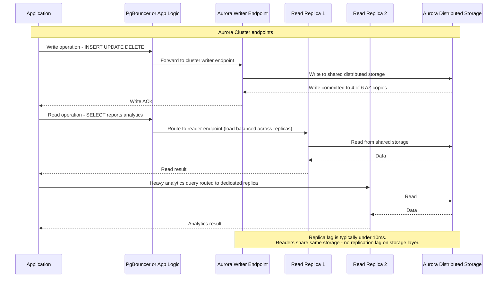
```mermaid
sequenceDiagram
    participant App as Application
    participant PB as PgBouncer or App Logic
    participant Writer as Aurora Writer Endpoint
    participant R1 as Read Replica 1
    participant R2 as Read Replica 2
    participant Storage as Aurora Distributed Storage

    note over App,Storage: Aurora Cluster endpoints

    App->>PB: Write operation - INSERT UPDATE DELETE
    PB->>Writer: Forward to cluster writer endpoint
    Writer->>Storage: Write to shared distributed storage
    Storage-->>Writer: Write committed to 4 of 6 AZ copies
    Writer-->>App: Write ACK

    App->>PB: Read operation - SELECT reports analytics
    PB->>R1: Route to reader endpoint (load balanced across replicas)
    R1->>Storage: Read from shared storage
    Storage-->>R1: Data
    R1-->>App: Read result

    App->>R2: Heavy analytics query routed to dedicated replica
    R2->>Storage: Read
    Storage-->>R2: Data
    R2-->>App: Analytics result

    note over Writer,Storage: Replica lag is typically under 10ms.<br/>Readers share same storage - no replication lag on storage layer.
```

---

## 4. Aurora Serverless v2 — Auto-Scaling

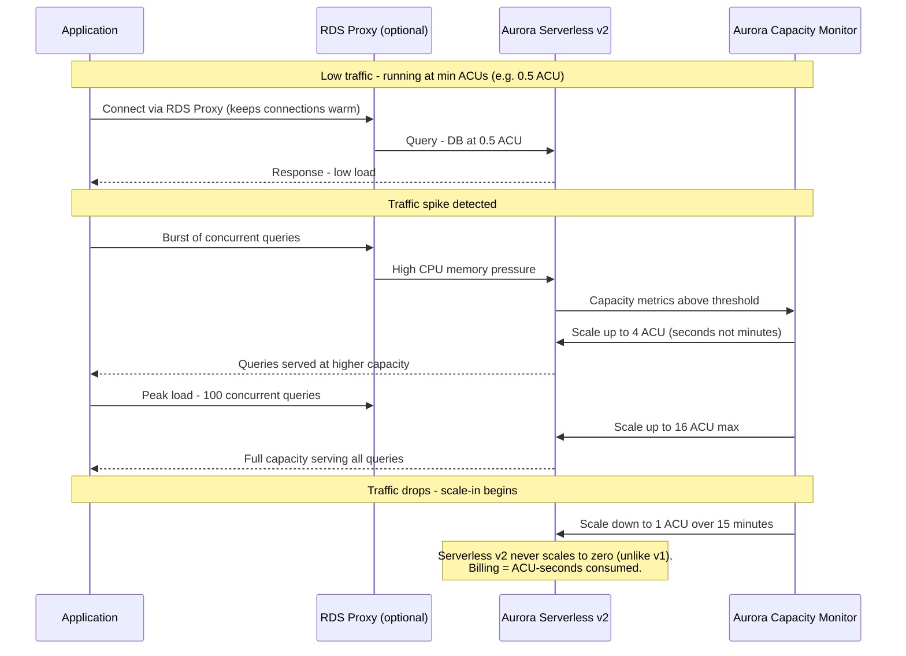
```mermaid
sequenceDiagram
    participant App as Application
    participant Proxy as RDS Proxy (optional)
    participant ASv2 as Aurora Serverless v2
    participant Monitor as Aurora Capacity Monitor

    note over App,Monitor: Low traffic - running at min ACUs (e.g. 0.5 ACU)

    App->>Proxy: Connect via RDS Proxy (keeps connections warm)
    Proxy->>ASv2: Query - DB at 0.5 ACU
    ASv2-->>App: Response - low load

    note over App,Monitor: Traffic spike detected

    App->>Proxy: Burst of concurrent queries
    Proxy->>ASv2: High CPU memory pressure
    ASv2->>Monitor: Capacity metrics above threshold
    Monitor->>ASv2: Scale up to 4 ACU (seconds not minutes)
    ASv2-->>App: Queries served at higher capacity

    App->>Proxy: Peak load - 100 concurrent queries
    Monitor->>ASv2: Scale up to 16 ACU max
    ASv2-->>App: Full capacity serving all queries

    note over App,Monitor: Traffic drops - scale-in begins

    Monitor->>ASv2: Scale down to 1 ACU over 15 minutes
    note over ASv2: Serverless v2 never scales to zero (unlike v1).<br/>Billing = ACU-seconds consumed.
```

---

## 5. Aurora Global Database — Multi-Region Replication

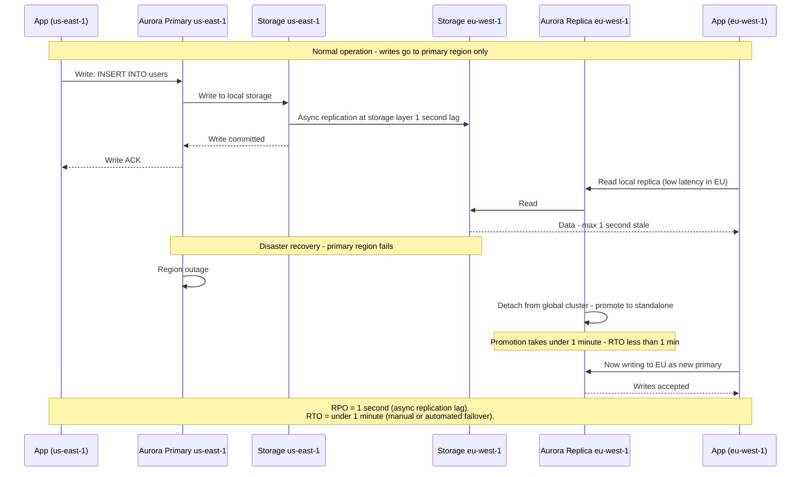
```mermaid
sequenceDiagram
    participant AppUS as App (us-east-1)
    participant PrimaryUS as Aurora Primary us-east-1
    participant StorageUS as Storage us-east-1
    participant StorageEU as Storage eu-west-1
    participant ReplicaEU as Aurora Replica eu-west-1
    participant AppEU as App (eu-west-1)

    note over AppUS,AppEU: Normal operation - writes go to primary region only

    AppUS->>PrimaryUS: Write: INSERT INTO users
    PrimaryUS->>StorageUS: Write to local storage
    StorageUS->>StorageEU: Async replication at storage layer 1 second lag
    StorageUS-->>PrimaryUS: Write committed
    PrimaryUS-->>AppUS: Write ACK

    AppEU->>ReplicaEU: Read local replica (low latency in EU)
    ReplicaEU->>StorageEU: Read
    StorageEU-->>AppEU: Data - max 1 second stale

    note over PrimaryUS,StorageEU: Disaster recovery - primary region fails

    PrimaryUS->>PrimaryUS: Region outage
    ReplicaEU->>ReplicaEU: Detach from global cluster - promote to standalone
    note over ReplicaEU: Promotion takes under 1 minute - RTO less than 1 min
    AppEU->>ReplicaEU: Now writing to EU as new primary
    ReplicaEU-->>AppEU: Writes accepted

    note over AppUS,AppEU: RPO = 1 second (async replication lag).<br/>RTO = under 1 minute (manual or automated failover).
```

---

## 6. Cache-Aside Pattern — Redis + PostgreSQL

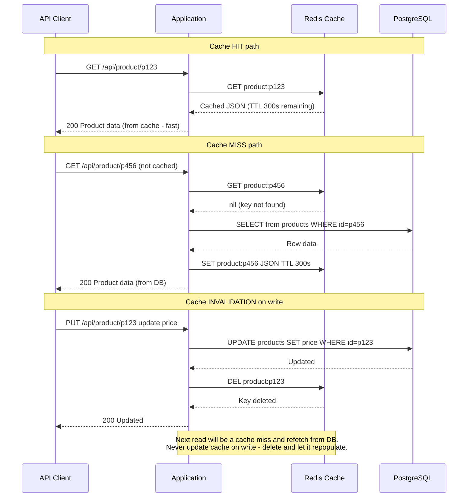
```mermaid
sequenceDiagram
    participant Client as API Client
    participant App as Application
    participant Redis as Redis Cache
    participant PG as PostgreSQL

    note over Client,PG: Cache HIT path

    Client->>App: GET /api/product/p123
    App->>Redis: GET product:p123
    Redis-->>App: Cached JSON (TTL 300s remaining)
    App-->>Client: 200 Product data (from cache - fast)

    note over Client,PG: Cache MISS path

    Client->>App: GET /api/product/p456 (not cached)
    App->>Redis: GET product:p456
    Redis-->>App: nil (key not found)
    App->>PG: SELECT from products WHERE id=p456
    PG-->>App: Row data
    App->>Redis: SET product:p456 JSON TTL 300s
    App-->>Client: 200 Product data (from DB)

    note over Client,PG: Cache INVALIDATION on write

    Client->>App: PUT /api/product/p123 update price
    App->>PG: UPDATE products SET price WHERE id=p123
    PG-->>App: Updated
    App->>Redis: DEL product:p123
    Redis-->>App: Key deleted
    App-->>Client: 200 Updated

    note over App,Redis: Next read will be a cache miss and refetch from DB.<br/>Never update cache on write - delete and let it repopulate.
```

---

## 7. Write-Through Cache Pattern

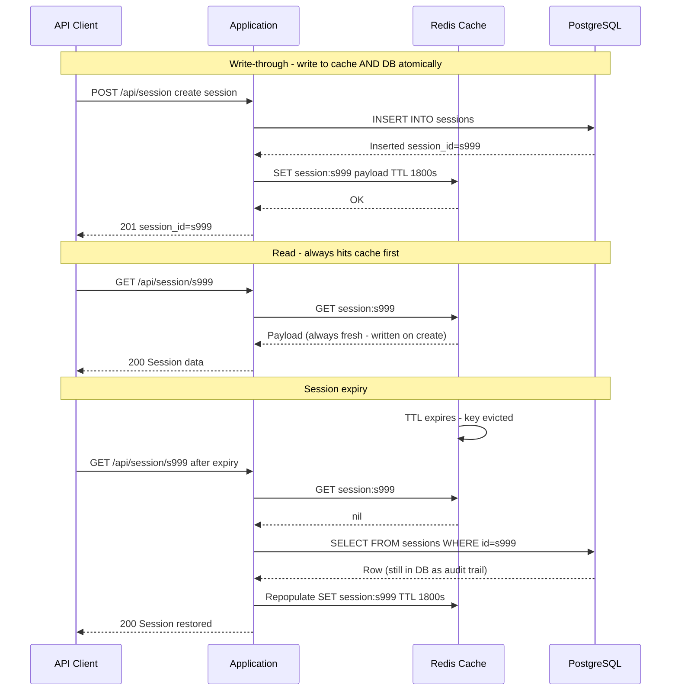
```mermaid
sequenceDiagram
    participant Client as API Client
    participant App as Application
    participant Redis as Redis Cache
    participant PG as PostgreSQL

    note over Client,PG: Write-through - write to cache AND DB atomically

    Client->>App: POST /api/session create session
    App->>PG: INSERT INTO sessions
    PG-->>App: Inserted session_id=s999
    App->>Redis: SET session:s999 payload TTL 1800s
    Redis-->>App: OK
    App-->>Client: 201 session_id=s999

    note over Client,PG: Read - always hits cache first

    Client->>App: GET /api/session/s999
    App->>Redis: GET session:s999
    Redis-->>App: Payload (always fresh - written on create)
    App-->>Client: 200 Session data

    note over Client,PG: Session expiry

    Redis->>Redis: TTL expires - key evicted
    Client->>App: GET /api/session/s999 after expiry
    App->>Redis: GET session:s999
    Redis-->>App: nil
    App->>PG: SELECT FROM sessions WHERE id=s999
    PG-->>App: Row (still in DB as audit trail)
    App->>Redis: Repopulate SET session:s999 TTL 1800s
    App-->>Client: 200 Session restored
```

---

## 8. CQRS — Command Query Responsibility Segregation

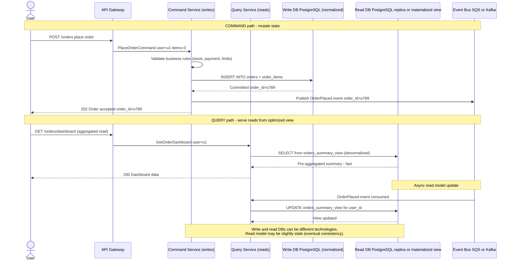
```mermaid
sequenceDiagram
    actor User as User
    participant API as API Gateway
    participant CmdSvc as Command Service (writes)
    participant QuerySvc as Query Service (reads)
    participant WriteDB as Write DB PostgreSQL (normalized)
    participant ReadDB as Read DB PostgreSQL replica or materialized view
    participant EventBus as Event Bus SQS or Kafka

    note over User,EventBus: COMMAND path - mutate state

    User->>API: POST /orders place order
    API->>CmdSvc: PlaceOrderCommand user=u1 items=3
    CmdSvc->>CmdSvc: Validate business rules (stock, payment, limits)
    CmdSvc->>WriteDB: INSERT INTO orders + order_items
    WriteDB-->>CmdSvc: Committed order_id=o789
    CmdSvc->>EventBus: Publish OrderPlaced event order_id=o789
    CmdSvc-->>User: 202 Order accepted order_id=o789

    note over User,EventBus: QUERY path - serve reads from optimized view

    User->>API: GET /orders/dashboard (aggregated read)
    API->>QuerySvc: GetOrderDashboard user=u1
    QuerySvc->>ReadDB: SELECT from orders_summary_view (denormalized)
    ReadDB-->>QuerySvc: Pre-aggregated summary - fast
    QuerySvc-->>User: 200 Dashboard data

    note over EventBus,ReadDB: Async read model update

    EventBus->>QuerySvc: OrderPlaced event consumed
    QuerySvc->>ReadDB: UPDATE orders_summary_view for user_id
    ReadDB-->>QuerySvc: View updated

    note over CmdSvc,ReadDB: Write and read DBs can be different technologies.<br/>Read model may be slightly stale (eventual consistency).
```

---

## 9. Saga Pattern — Choreography (Event-Driven)

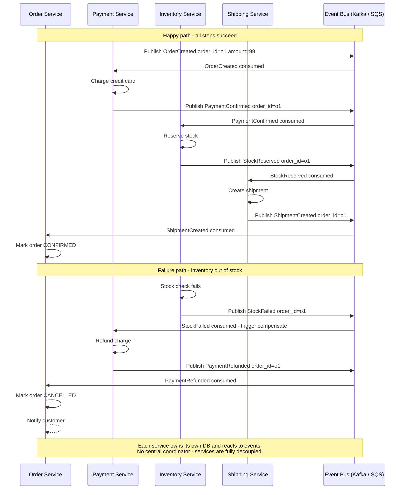
```mermaid
sequenceDiagram
    participant Order as Order Service
    participant Payment as Payment Service
    participant Inventory as Inventory Service
    participant Shipping as Shipping Service
    participant Bus as Event Bus (Kafka / SQS)

    note over Order,Bus: Happy path - all steps succeed

    Order->>Bus: Publish OrderCreated order_id=o1 amount=99
    Bus->>Payment: OrderCreated consumed
    Payment->>Payment: Charge credit card
    Payment->>Bus: Publish PaymentConfirmed order_id=o1
    Bus->>Inventory: PaymentConfirmed consumed
    Inventory->>Inventory: Reserve stock
    Inventory->>Bus: Publish StockReserved order_id=o1
    Bus->>Shipping: StockReserved consumed
    Shipping->>Shipping: Create shipment
    Shipping->>Bus: Publish ShipmentCreated order_id=o1
    Bus->>Order: ShipmentCreated consumed
    Order->>Order: Mark order CONFIRMED

    note over Order,Bus: Failure path - inventory out of stock

    Inventory->>Inventory: Stock check fails
    Inventory->>Bus: Publish StockFailed order_id=o1
    Bus->>Payment: StockFailed consumed - trigger compensate
    Payment->>Payment: Refund charge
    Payment->>Bus: Publish PaymentRefunded order_id=o1
    Bus->>Order: PaymentRefunded consumed
    Order->>Order: Mark order CANCELLED
    Order-->>Order: Notify customer

    note over Order,Bus: Each service owns its own DB and reacts to events.<br/>No central coordinator - services are fully decoupled.
```

---

## 10. Saga Pattern — Orchestration (Central Coordinator)

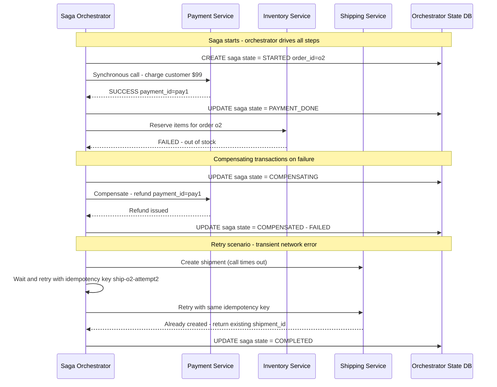
```mermaid
sequenceDiagram
    participant Orch as Saga Orchestrator
    participant Payment as Payment Service
    participant Inventory as Inventory Service
    participant Shipping as Shipping Service
    participant DB as Orchestrator State DB

    note over Orch,DB: Saga starts - orchestrator drives all steps

    Orch->>DB: CREATE saga state = STARTED order_id=o2
    Orch->>Payment: Synchronous call - charge customer $99
    Payment-->>Orch: SUCCESS payment_id=pay1

    Orch->>DB: UPDATE saga state = PAYMENT_DONE
    Orch->>Inventory: Reserve items for order o2
    Inventory-->>Orch: FAILED - out of stock

    note over Orch,DB: Compensating transactions on failure

    Orch->>DB: UPDATE saga state = COMPENSATING
    Orch->>Payment: Compensate - refund payment_id=pay1
    Payment-->>Orch: Refund issued
    Orch->>DB: UPDATE saga state = COMPENSATED - FAILED

    note over Orch,DB: Retry scenario - transient network error

    Orch->>Shipping: Create shipment (call times out)
    Orch->>Orch: Wait and retry with idempotency key ship-o2-attempt2
    Orch->>Shipping: Retry with same idempotency key
    Shipping-->>Orch: Already created - return existing shipment_id
    Orch->>DB: UPDATE saga state = COMPLETED
```

---

## 11. Transactional Outbox Pattern

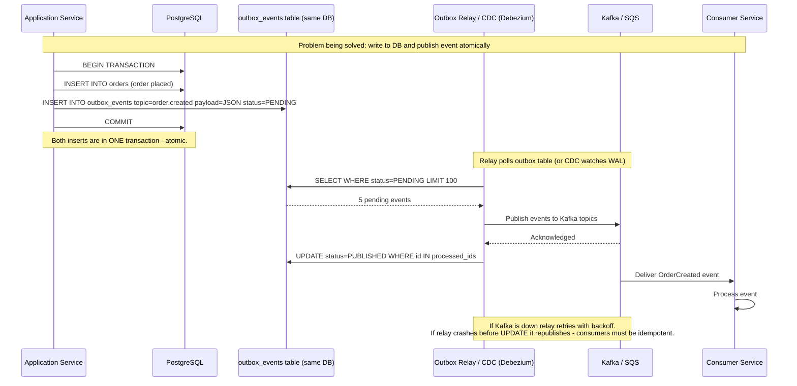
```mermaid
sequenceDiagram
    participant App as Application Service
    participant DB as PostgreSQL
    participant Outbox as outbox_events table (same DB)
    participant Relay as Outbox Relay / CDC (Debezium)
    participant Kafka as Kafka / SQS
    participant Consumer as Consumer Service

    note over App,Consumer: Problem being solved: write to DB and publish event atomically

    App->>DB: BEGIN TRANSACTION
    App->>DB: INSERT INTO orders (order placed)
    App->>Outbox: INSERT INTO outbox_events topic=order.created payload=JSON status=PENDING
    App->>DB: COMMIT
    note over App,DB: Both inserts are in ONE transaction - atomic.

    note over Relay,Kafka: Relay polls outbox table (or CDC watches WAL)

    Relay->>Outbox: SELECT WHERE status=PENDING LIMIT 100
    Outbox-->>Relay: 5 pending events
    Relay->>Kafka: Publish events to Kafka topics
    Kafka-->>Relay: Acknowledged
    Relay->>Outbox: UPDATE status=PUBLISHED WHERE id IN processed_ids

    Kafka->>Consumer: Deliver OrderCreated event
    Consumer->>Consumer: Process event

    note over Relay,Kafka: If Kafka is down relay retries with backoff.<br/>If relay crashes before UPDATE it republishes - consumers must be idempotent.
```

---

## 12. PostgreSQL Row-Level Security — Multi-Tenant Data Isolation

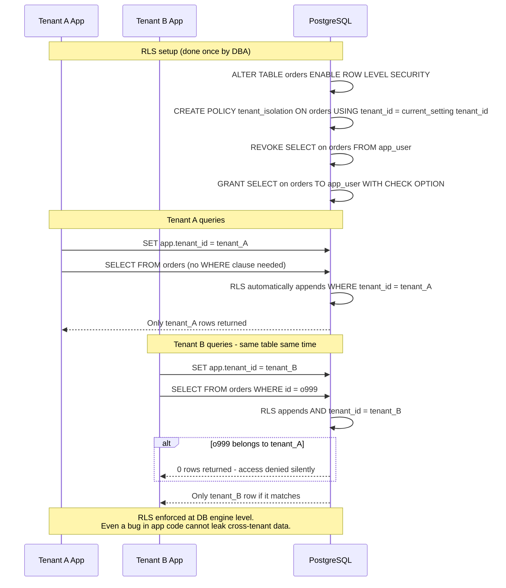
```mermaid
sequenceDiagram
    participant AppA as Tenant A App
    participant AppB as Tenant B App
    participant PG as PostgreSQL

    note over AppA,PG: RLS setup (done once by DBA)
    PG->>PG: ALTER TABLE orders ENABLE ROW LEVEL SECURITY
    PG->>PG: CREATE POLICY tenant_isolation ON orders USING tenant_id = current_setting tenant_id
    PG->>PG: REVOKE SELECT on orders FROM app_user
    PG->>PG: GRANT SELECT on orders TO app_user WITH CHECK OPTION

    note over AppA,PG: Tenant A queries

    AppA->>PG: SET app.tenant_id = tenant_A
    AppA->>PG: SELECT FROM orders (no WHERE clause needed)
    PG->>PG: RLS automatically appends WHERE tenant_id = tenant_A
    PG-->>AppA: Only tenant_A rows returned

    note over AppB,PG: Tenant B queries - same table same time

    AppB->>PG: SET app.tenant_id = tenant_B
    AppB->>PG: SELECT FROM orders WHERE id = o999
    PG->>PG: RLS appends AND tenant_id = tenant_B
    alt o999 belongs to tenant_A
        PG-->>AppB: 0 rows returned - access denied silently
    end
    PG-->>AppB: Only tenant_B row if it matches

    note over AppA,PG: RLS enforced at DB engine level.<br/>Even a bug in app code cannot leak cross-tenant data.
```

---

## 13. Database Schema Migration — Zero Downtime Strategy

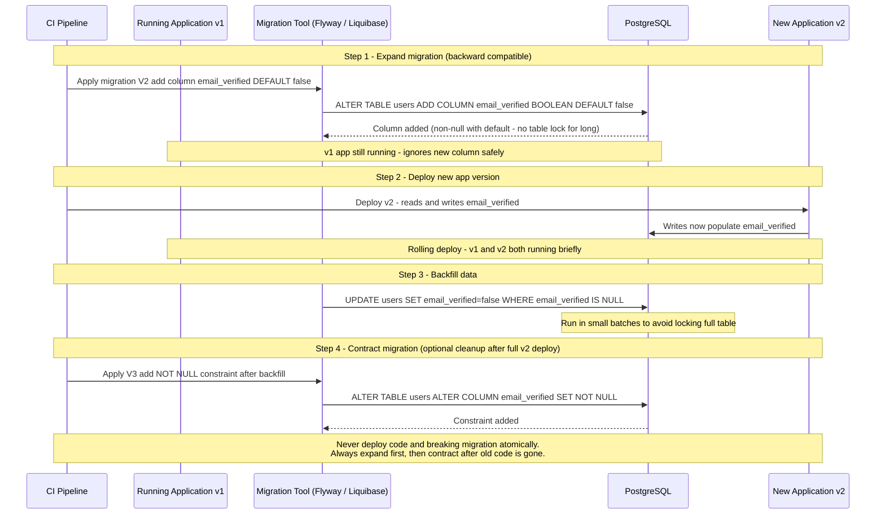
```mermaid
sequenceDiagram
    participant CI as CI Pipeline
    participant App as Running Application v1
    participant Migrate as Migration Tool (Flyway / Liquibase)
    participant PG as PostgreSQL
    participant AppV2 as New Application v2

    note over CI,AppV2: Step 1 - Expand migration (backward compatible)

    CI->>Migrate: Apply migration V2 add column email_verified DEFAULT false
    Migrate->>PG: ALTER TABLE users ADD COLUMN email_verified BOOLEAN DEFAULT false
    PG-->>Migrate: Column added (non-null with default - no table lock for long)
    note over App,PG: v1 app still running - ignores new column safely

    note over CI,AppV2: Step 2 - Deploy new app version

    CI->>AppV2: Deploy v2 - reads and writes email_verified
    AppV2->>PG: Writes now populate email_verified
    note over App,AppV2: Rolling deploy - v1 and v2 both running briefly

    note over CI,AppV2: Step 3 - Backfill data

    Migrate->>PG: UPDATE users SET email_verified=false WHERE email_verified IS NULL
    note over PG: Run in small batches to avoid locking full table

    note over CI,AppV2: Step 4 - Contract migration (optional cleanup after full v2 deploy)

    CI->>Migrate: Apply V3 add NOT NULL constraint after backfill
    Migrate->>PG: ALTER TABLE users ALTER COLUMN email_verified SET NOT NULL
    PG-->>Migrate: Constraint added

    note over CI,AppV2: Never deploy code and breaking migration atomically.<br/>Always expand first, then contract after old code is gone.
```

---

## 14. Read Replica Lag — Handling Stale Reads

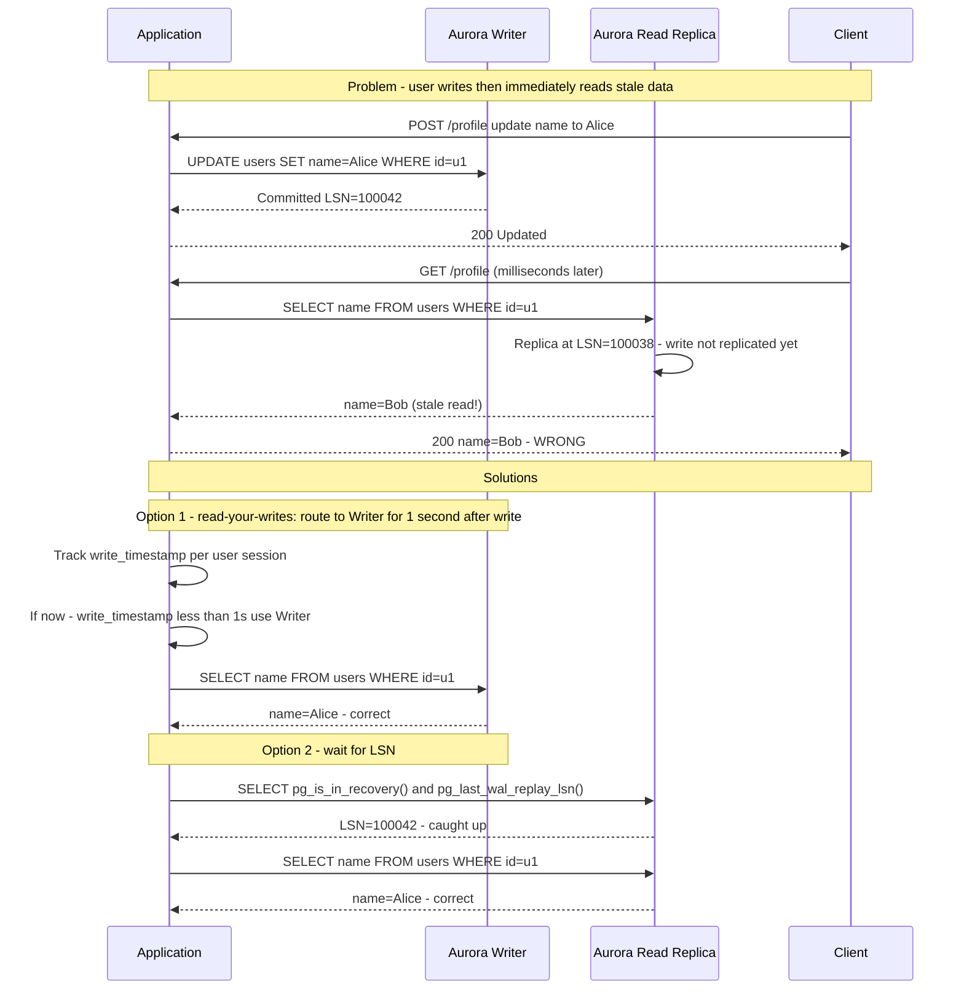
```mermaid
sequenceDiagram
    participant App as Application
    participant Writer as Aurora Writer
    participant Replica as Aurora Read Replica
    participant Client as Client

    note over App,Client: Problem - user writes then immediately reads stale data

    Client->>App: POST /profile update name to Alice
    App->>Writer: UPDATE users SET name=Alice WHERE id=u1
    Writer-->>App: Committed LSN=100042
    App-->>Client: 200 Updated

    Client->>App: GET /profile (milliseconds later)
    App->>Replica: SELECT name FROM users WHERE id=u1
    Replica->>Replica: Replica at LSN=100038 - write not replicated yet
    Replica-->>App: name=Bob (stale read!)
    App-->>Client: 200 name=Bob - WRONG

    note over App,Client: Solutions

    note over App,Writer: Option 1 - read-your-writes: route to Writer for 1 second after write
    App->>App: Track write_timestamp per user session
    App->>App: If now - write_timestamp less than 1s use Writer
    App->>Writer: SELECT name FROM users WHERE id=u1
    Writer-->>App: name=Alice - correct

    note over App,Writer: Option 2 - wait for LSN
    App->>Replica: SELECT pg_is_in_recovery() and pg_last_wal_replay_lsn()
    Replica-->>App: LSN=100042 - caught up
    App->>Replica: SELECT name FROM users WHERE id=u1
    Replica-->>App: name=Alice - correct
```

---

## 15. Event Sourcing — Append-Only Event Store

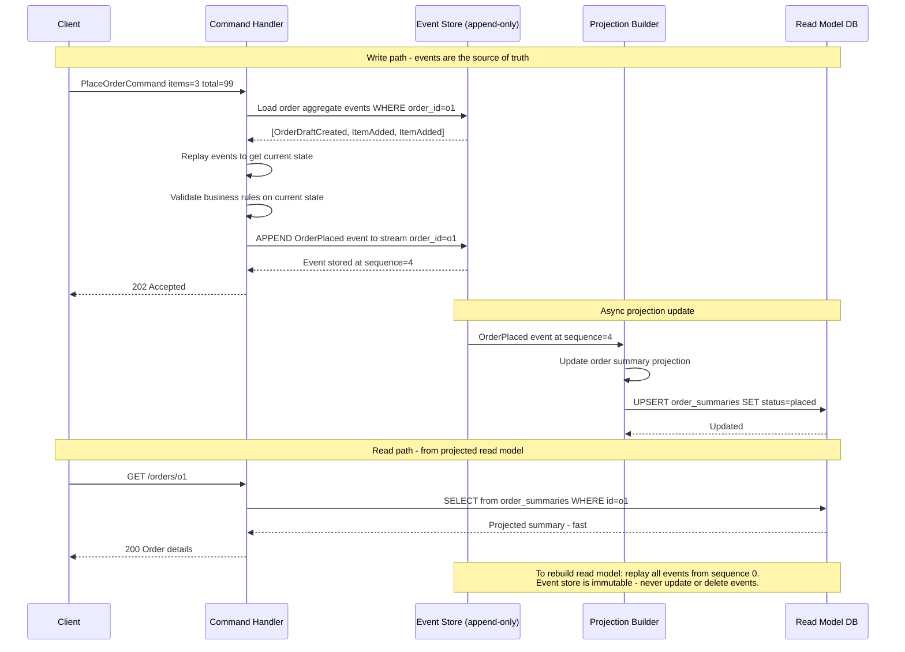
```mermaid
sequenceDiagram
    participant Client as Client
    participant App as Command Handler
    participant ES as Event Store (append-only)
    participant Proj as Projection Builder
    participant ReadDB as Read Model DB

    note over Client,ReadDB: Write path - events are the source of truth

    Client->>App: PlaceOrderCommand items=3 total=99
    App->>ES: Load order aggregate events WHERE order_id=o1
    ES-->>App: [OrderDraftCreated, ItemAdded, ItemAdded]
    App->>App: Replay events to get current state
    App->>App: Validate business rules on current state
    App->>ES: APPEND OrderPlaced event to stream order_id=o1
    ES-->>App: Event stored at sequence=4
    App-->>Client: 202 Accepted

    note over ES,ReadDB: Async projection update

    ES->>Proj: OrderPlaced event at sequence=4
    Proj->>Proj: Update order summary projection
    Proj->>ReadDB: UPSERT order_summaries SET status=placed
    ReadDB-->>Proj: Updated

    note over Client,ReadDB: Read path - from projected read model

    Client->>App: GET /orders/o1
    App->>ReadDB: SELECT from order_summaries WHERE id=o1
    ReadDB-->>App: Projected summary - fast
    App-->>Client: 200 Order details

    note over ES,ReadDB: To rebuild read model: replay all events from sequence 0.<br/>Event store is immutable - never update or delete events.
```

---

## Summary — Database Pattern Reference

| Pattern | Problem Solved | Key Trade-off |
|---------|---------------|---------------|
| PgBouncer | Too many DB connections from pods | Extra hop, no prepared statement support in transaction mode |
| Multi-AZ RDS | Single point of failure | 20-120s failover RTO |
| Aurora Reader | Read scaling, reporting load | Up to 10ms replica lag |
| Aurora Serverless v2 | Unpredictable variable load | Min ACU cost even at idle |
| Aurora Global DB | Multi-region reads, DR | 1s replication lag RPO |
| Cache-Aside | Reduce DB read load | Cache stampede on cold start |
| Write-Through | Always-fresh cache on read | Write latency penalty |
| CQRS | Separate read/write scaling | Eventual consistency on read side |
| Saga Choreography | Distributed transactions no central point | Hard to track overall saga state |
| Saga Orchestration | Centralized distributed transaction logic | Orchestrator is single point of knowledge |
| Outbox Pattern | Atomic DB write + event publish | Relay infrastructure needed |
| Row-Level Security | Multi-tenant data isolation at DB | Performance overhead on every query |
| Zero-downtime migration | Deploy schema changes without downtime | Expand/contract adds deploy steps |
| Event Sourcing | Full audit trail, time travel, rebuild projections | Complexity, eventual consistency on reads |
