# Database Migration & DR Sequence Diagrams

Sequence diagrams for every major database migration path, disaster recovery scenario, backup/restore flow, and K8s database operation.

---

## 1. On-Prem PostgreSQL to Aurora PostgreSQL — Online Migration (Zero Downtime)

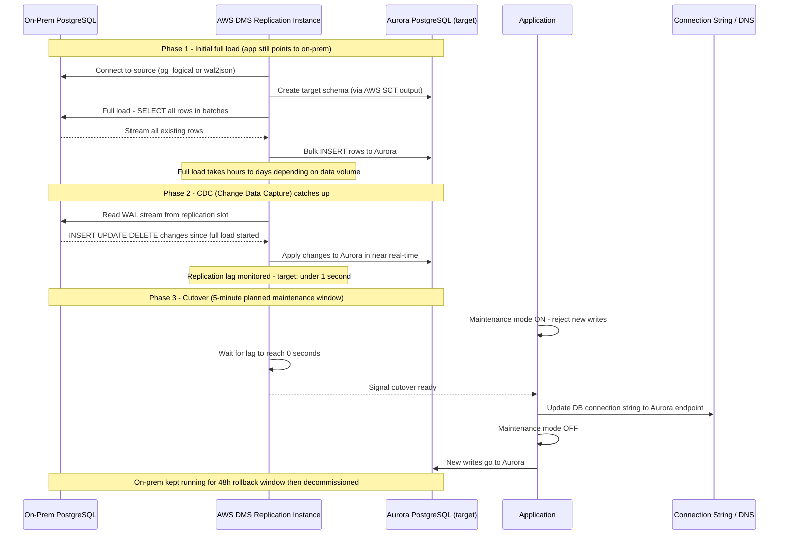

---

## 2. Oracle to Aurora PostgreSQL — Schema Conversion + DMS

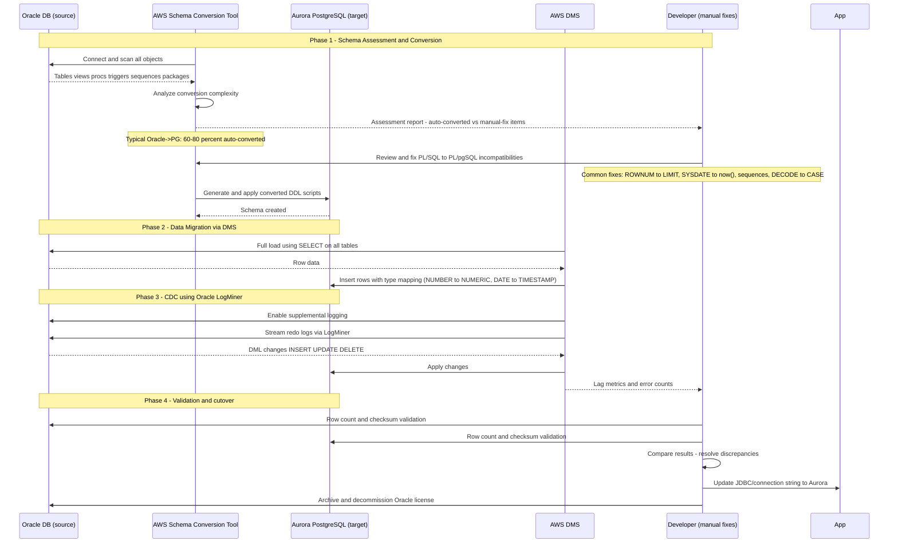

---

## 3. MySQL to Aurora MySQL — Near-Zero Downtime via Snapshot

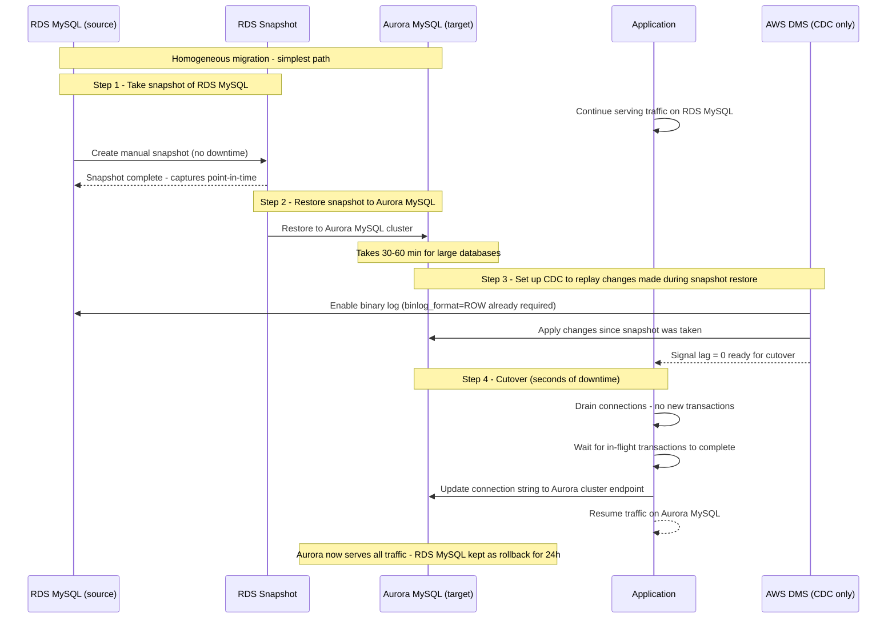

---

## 4. SQL Server to Aurora PostgreSQL — Enterprise Migration

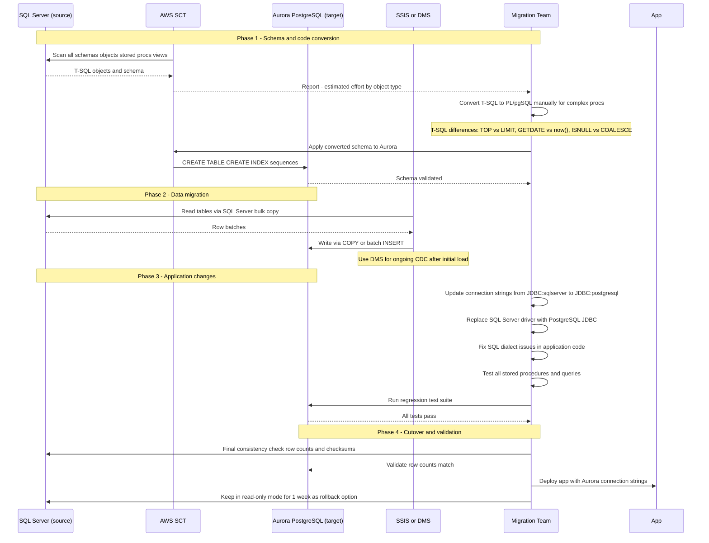

---

## 5. K8s PostgreSQL StatefulSet — Backup to S3 with CronJob

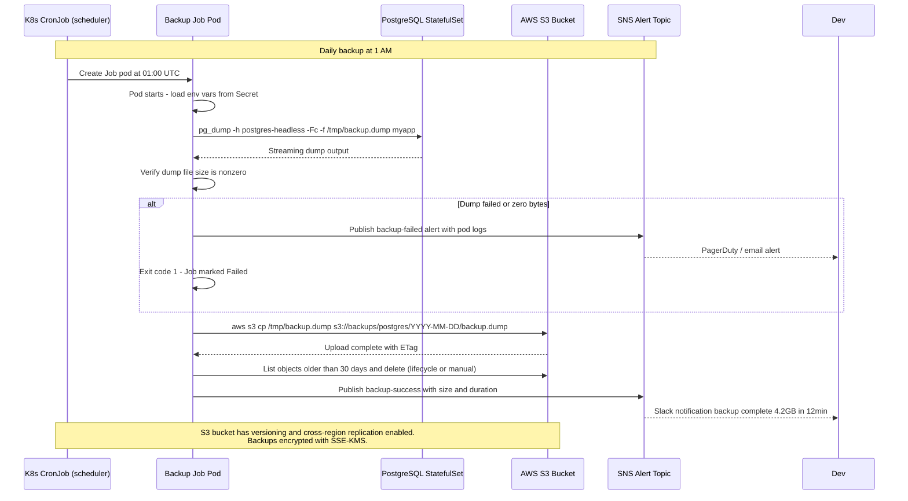

---

## 6. Aurora Multi-AZ Failover — Step-by-Step

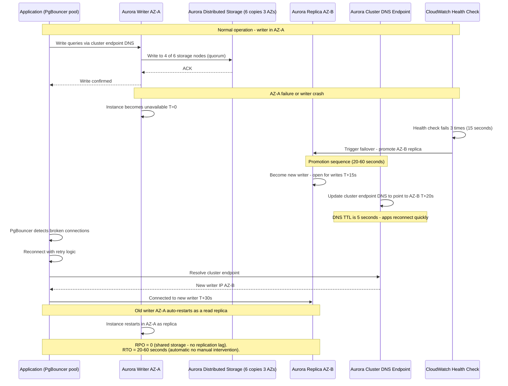

---

## 7. Point-in-Time Recovery (PITR)

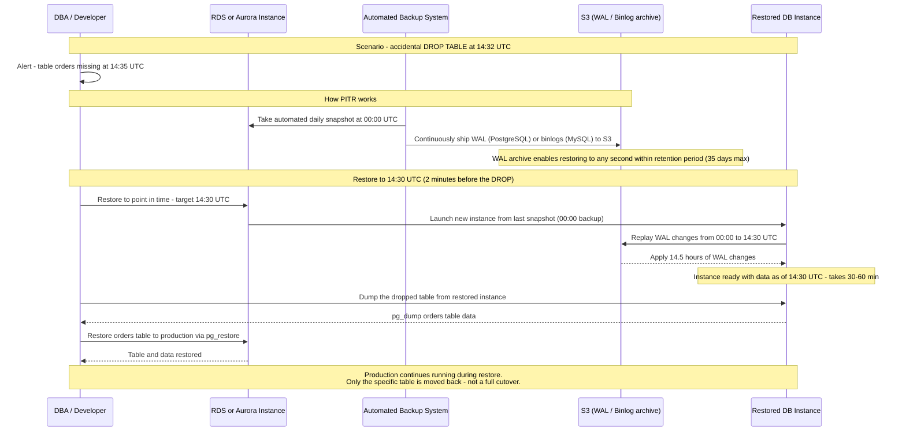

---

## 8. Aurora Global Database — Planned Region Failover

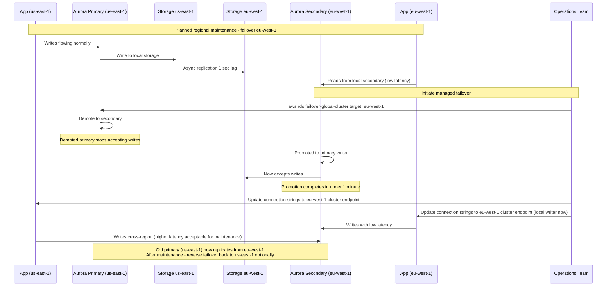

---

## 9. Database Schema Migration — K8s Rolling Deploy

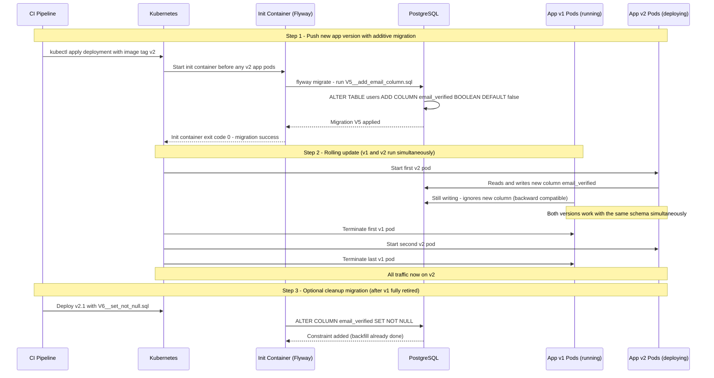

---

## 10. Read Replica Promotion — DR Runbook

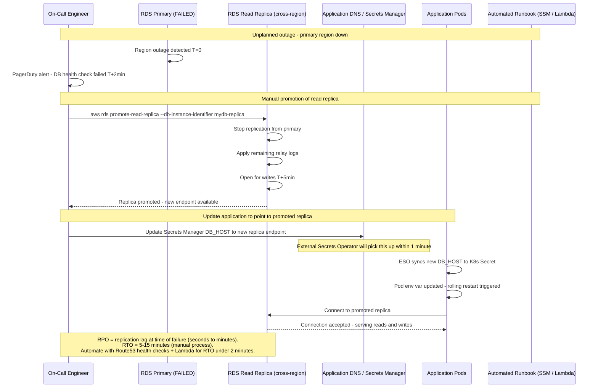

---

## 11. DynamoDB Global Tables — Multi-Region Write

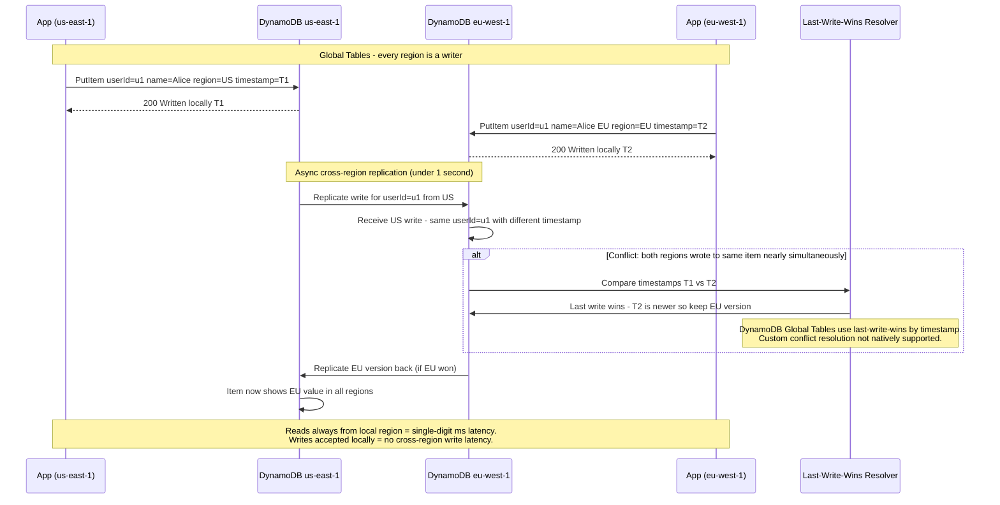

---

## 12. Cross-Account Database Snapshot — Compliance Backup

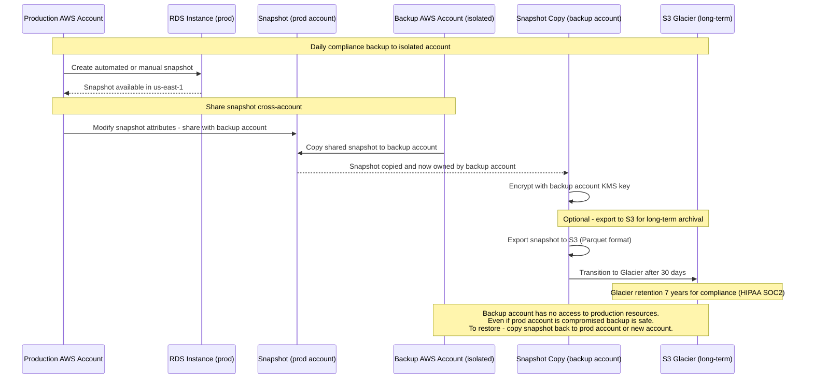

---

## 13. Velero — K8s StatefulSet PVC Backup and Restore

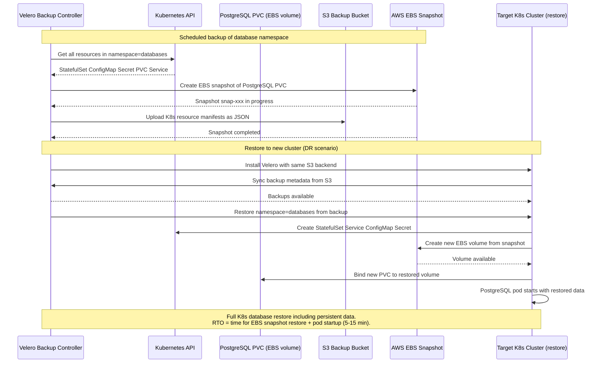

---

## 14. Aurora Serverless v2 — Connection Scaling with RDS Proxy

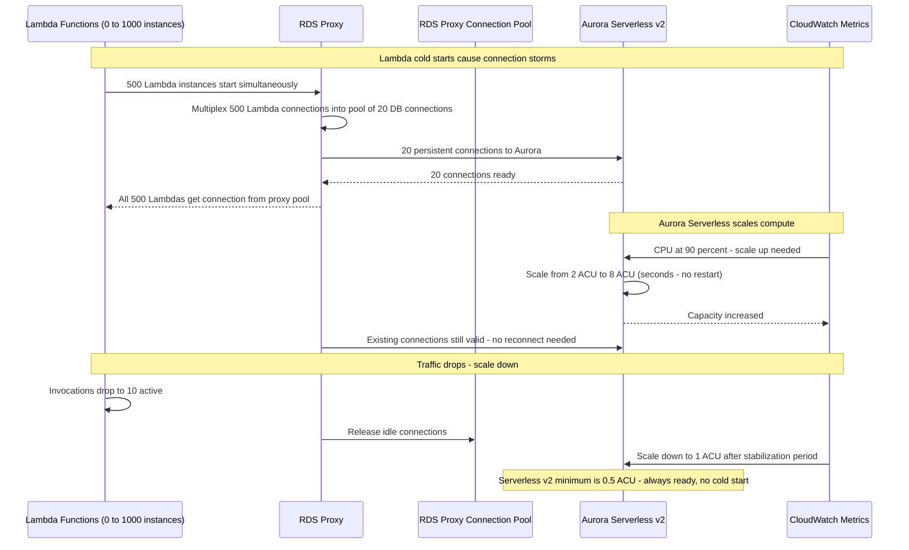

---

## Summary — Migration and DR Quick Reference

| Scenario | Key Steps | Expected Downtime | Tools |
|----------|-----------|------------------|-------|
| On-prem PG to Aurora | Full load + CDC + cutover | 0 to 5 min | AWS DMS |
| Oracle to Aurora PG | SCT schema conversion + DMS | 0 to 5 min | SCT + DMS |
| MySQL to Aurora MySQL | Snapshot restore + DMS CDC | 0 to 2 min | Snapshot + DMS |
| SQL Server to Aurora PG | SCT + DMS + app changes | 1 to 4 hours | SCT + DMS |
| K8s PG backup to S3 | pg_dump via CronJob | None | pg_dump + aws s3 |
| Aurora Multi-AZ failover | Automatic | 20 to 60 sec | Built-in |
| PITR restore | Launch new instance from WAL | None (new instance) | RDS PITR |
| Aurora Global failover | Promote secondary | Under 1 min | aws rds failover-global-cluster |
| K8s rolling migration | Init container runs Flyway | 0 (rolling) | Flyway + init container |
| Read replica promotion | Manual promote + DNS update | 5 to 15 min | aws rds promote-read-replica |
| Cross-account snapshot | Share + copy snapshot | None | RDS snapshot share |
| Velero K8s restore | Apply backup to new cluster | 5 to 15 min | Velero + EBS snapshots |
