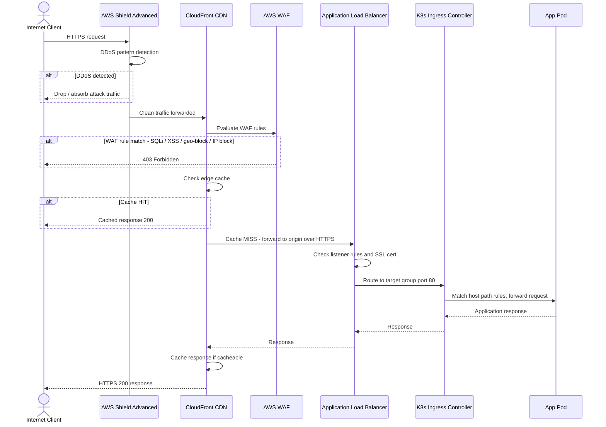
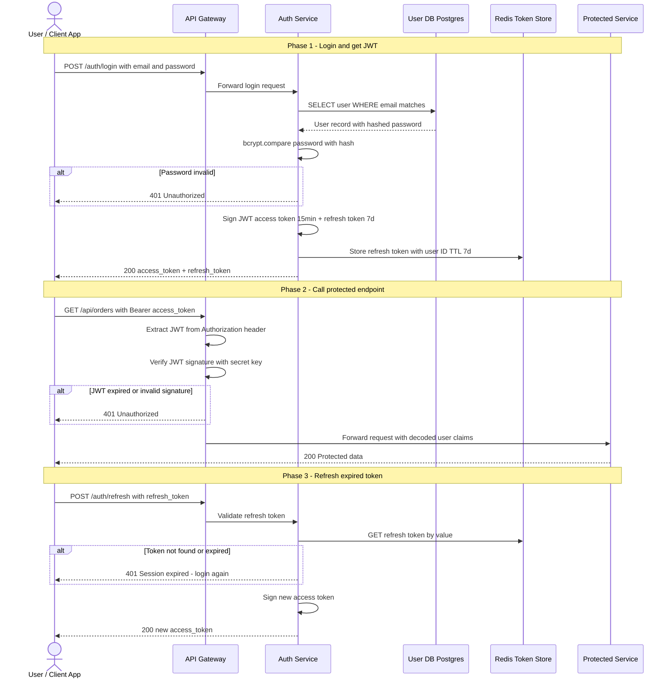
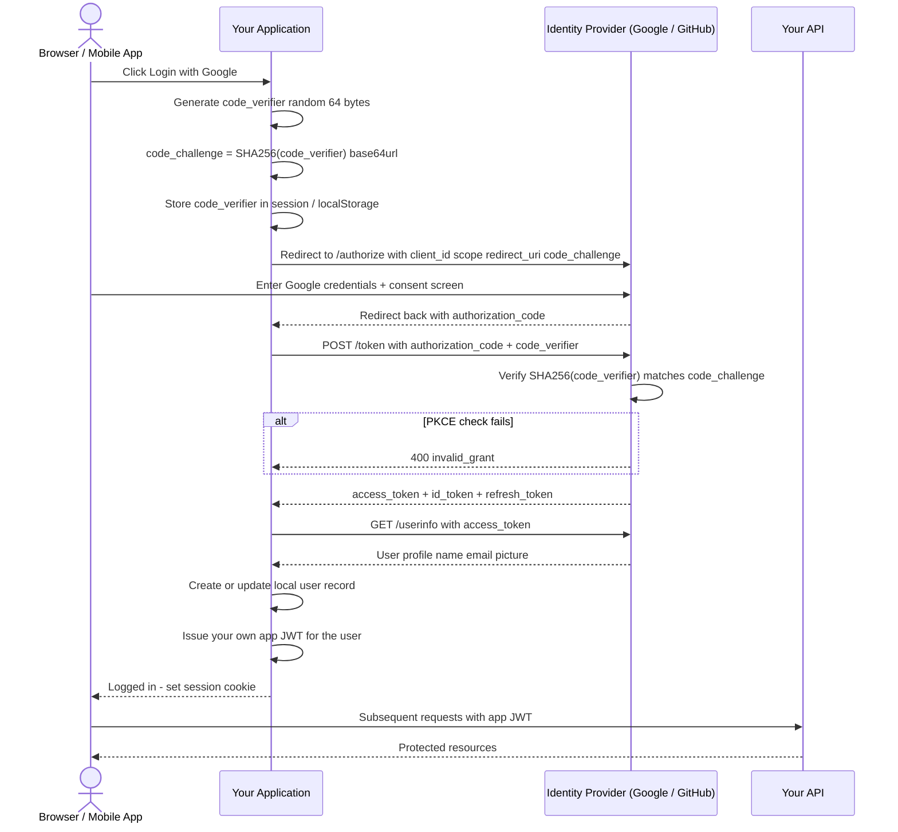
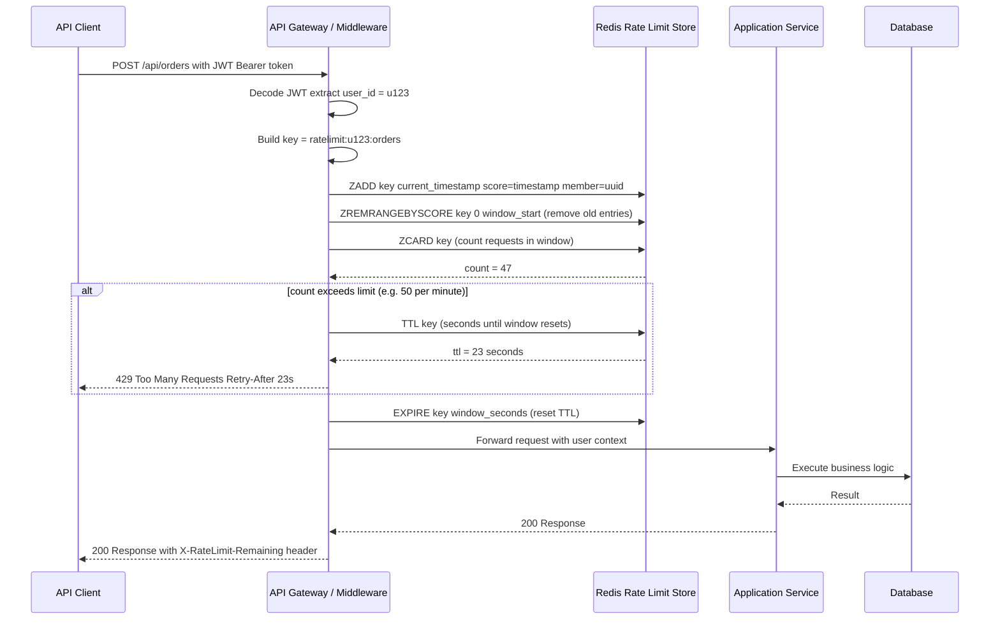
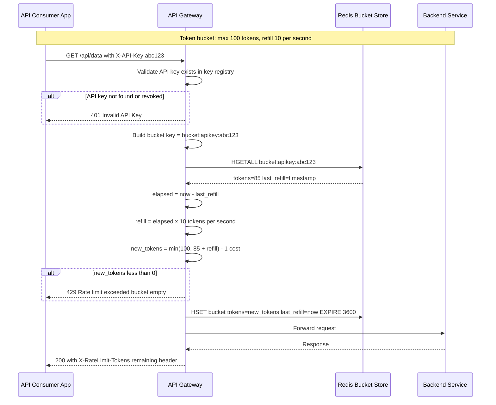
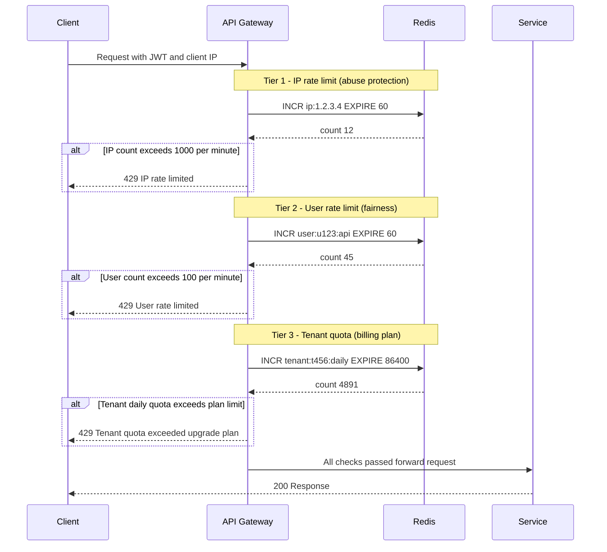
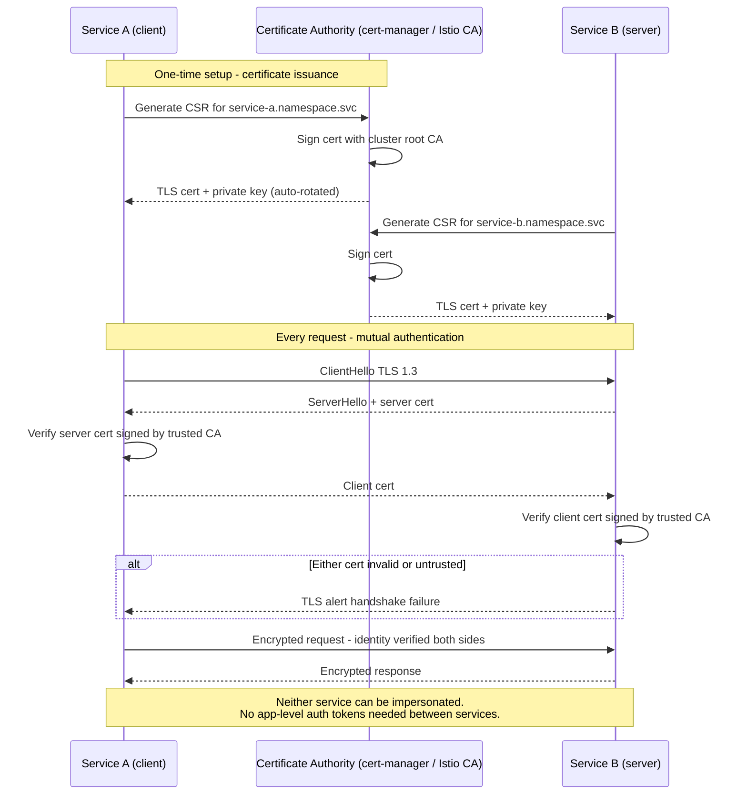
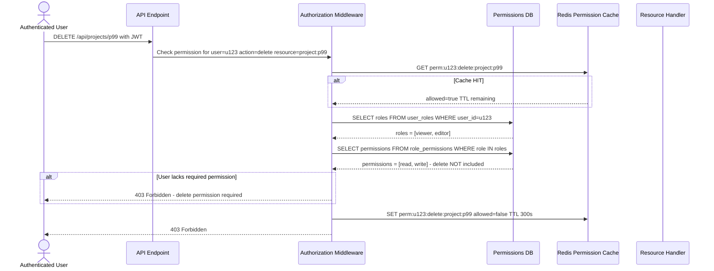
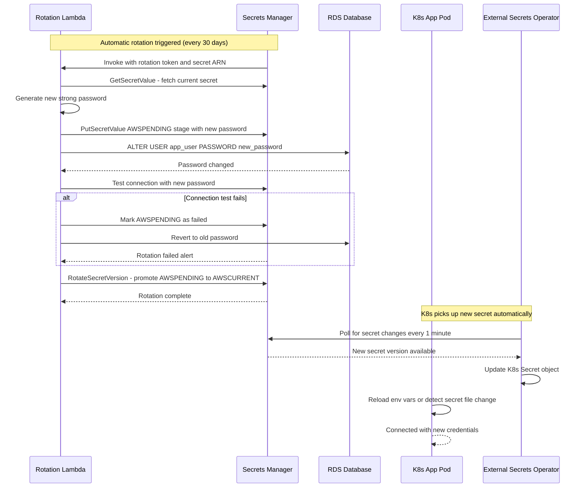
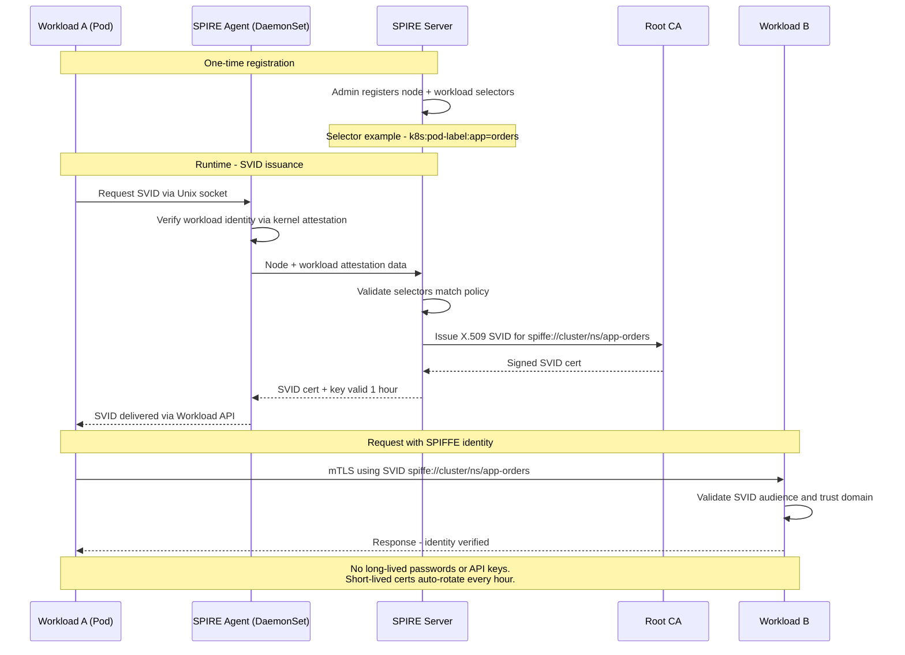

# Security Architecture Diagrams

Reference diagrams for WAF, DDoS protection, authentication, rate limiting, mTLS, RBAC, and secrets management.

---

## 1. WAF + CloudFront + ALB + EKS — Full Request Path

---

## 2. JWT Authentication — Login and Token Validation

---

## 3. OAuth2 Authorization Code Flow with PKCE

---

## 4. API Rate Limiting by User ID — Redis Sliding Window

---

## 5. API Rate Limiting by API Token — Token Bucket Algorithm

---

## 6. Multi-Tier Rate Limiting — IP + User + Tenant

---

## 7. mTLS — Mutual TLS Between Microservices

---

## 8. RBAC Authorization — Role Based Access Control

---

## 9. AWS Secrets Manager — Secret Rotation Flow

---

## 10. Zero Trust — Service Identity with SPIFFE / SPIRE

---

## Summary — When to Use Each Pattern

| Pattern | Best For | Key Tool |
|---------|----------|----------|
| WAF + Shield | Public APIs, DDoS protection | AWS WAF, CloudFront |
| JWT Auth | Stateless API auth, microservices | jsonwebtoken, Auth0 |
| OAuth2 PKCE | Third-party login, mobile apps | Cognito, Auth0, Google |
| User rate limit | Fair usage, abuse prevention | Redis ZADD sliding window |
| API key bucket | Paid API tiers, B2B consumers | Redis HSET token bucket |
| Multi-tier limits | Production APIs with billing | Redis composite keys |
| mTLS | Service-to-service internal auth | cert-manager, Istio |
| RBAC | Feature access control | OPA, Casbin, DB roles |
| Secrets rotation | Credential hygiene, compliance | AWS Secrets Manager |
| SPIFFE / SPIRE | Zero-trust, no static secrets | SPIRE, Istio SPIFFE |
