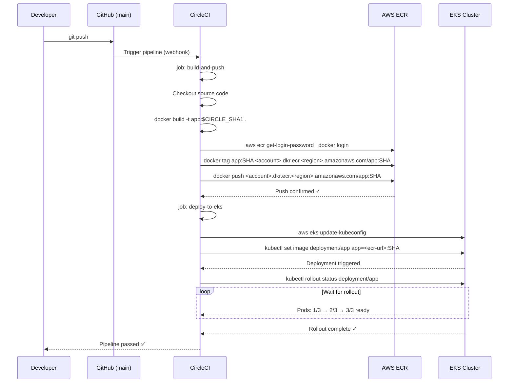
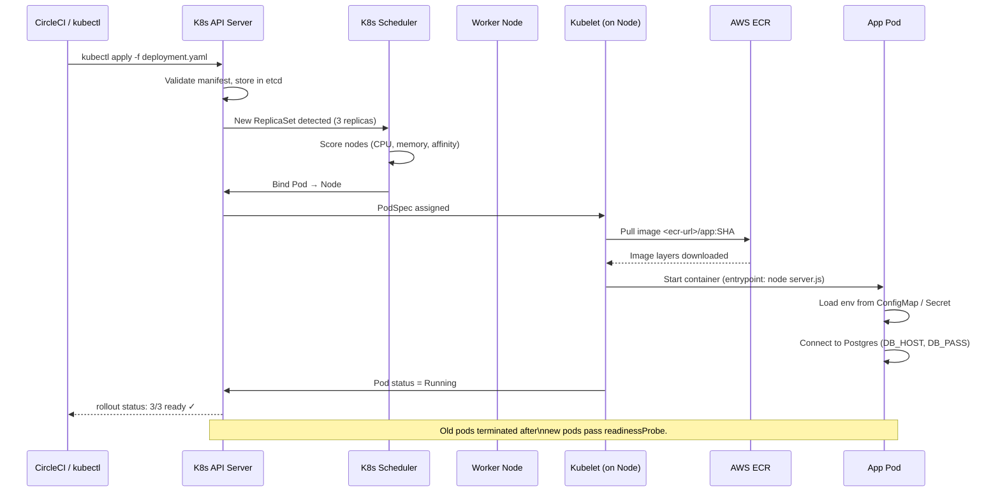
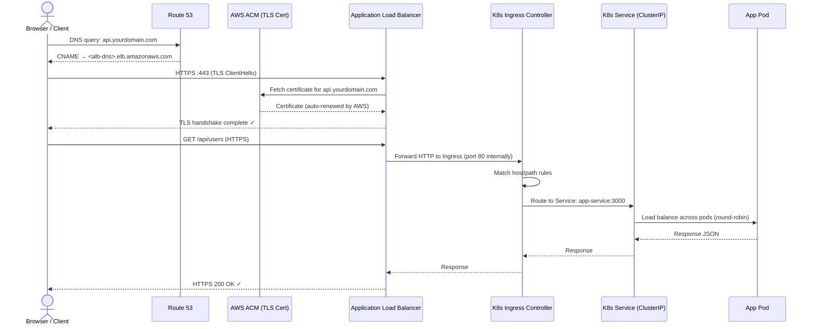
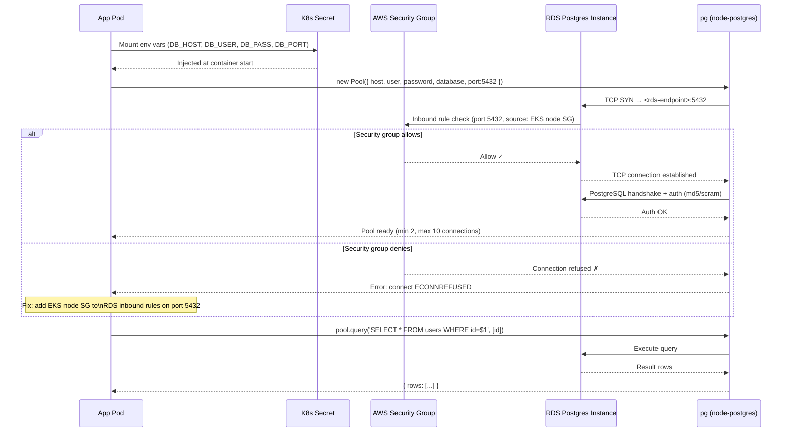
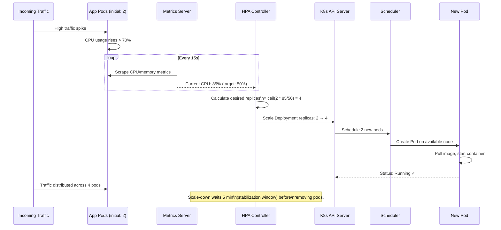
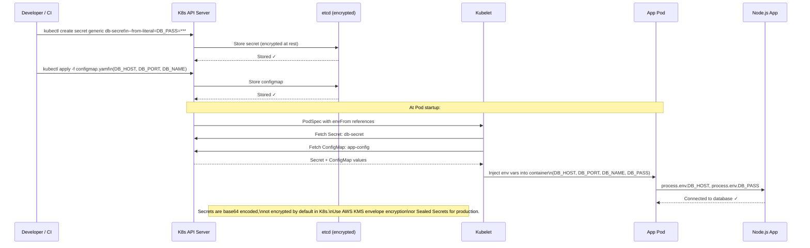

# Sequence Diagrams — AWS EKS/ECR Node.js + Postgres

All diagrams use [Mermaid](https://mermaid.js.org/) syntax and render automatically on GitHub.

---

## 1. High-Level End-to-End Flow

```mermaid
sequenceDiagram
    actor Dev as Developer
    participant GH as GitHub
    participant CI as CircleCI
    participant ECR as AWS ECR
    participant EKS as AWS EKS
    participant RDS as RDS/Postgres
    actor User as End User
    participant R53 as Route 53 + ACM

    Dev->>GH: git push (main branch)
    GH-->>CI: Webhook trigger

    rect rgb(30, 50, 80)
        note over CI,ECR: Build & Publish Phase
        CI->>CI: Checkout code, run tests
        CI->>ECR: docker build + docker push (image:SHA)
    end

    rect rgb(30, 60, 50)
        note over CI,EKS: Deploy Phase
        CI->>EKS: kubectl set image / apply manifests
        EKS->>ECR: Pull new image
        EKS->>EKS: Rolling update (zero downtime)
        EKS->>RDS: Verify DB connection
    end

    rect rgb(60, 30, 50)
        note over User,R53: Request Phase
        User->>R53: HTTPS request (api.yourdomain.com)
        R53->>EKS: Resolve to ALB / LoadBalancer IP
        EKS->>RDS: App queries database
        RDS-->>EKS: Query result
        EKS-->>User: HTTP 200 response
    end
```



---

## 2. CI/CD Pipeline — CircleCI Detail



---

## 3. Docker Image Build & ECR Push

```mermaid
sequenceDiagram
    participant Dev as Developer / CI
    participant Docker as Docker Daemon
    participant ECR as AWS ECR Registry

    Dev->>Docker: docker build -t app:latest .
    Docker->>Docker: Read Dockerfile layers
    Docker->>Docker: npm install (cached layer)
    Docker->>Docker: COPY app source
    Docker->>Docker: EXPOSE 3000
    Docker-->>Dev: Image built ✓ (e.g. 180 MB)

    Dev->>ECR: aws ecr get-login-password --region us-east-1
    ECR-->>Dev: Auth token (12h TTL)

    Dev->>Docker: docker login -u AWS -p <token> <ecr-url>
    Docker-->>Dev: Login succeeded ✓

    Dev->>Docker: docker tag app:latest <ecr-url>/app:SHA
    Dev->>Docker: docker push <ecr-url>/app:SHA
    Docker->>ECR: Upload layers (only delta layers)
    ECR-->>Docker: Layer already exists / Pushed
    ECR-->>Dev: Digest: sha256:abc123 ✓

    note over ECR: Image immutable once pushed.\nTag :latest can be overwritten;\ntag :SHA is permanent.
```

---

## 4. EKS Pod Scheduling & Deployment



---

## 5. DNS Resolution & HTTPS via Route 53 + ACM



---

## 6. Database Connection Flow (App → RDS Postgres)



---

## 7. Kubernetes Auto-Scaling Flow (HPA)



---

## 8. Secret & ConfigMap Injection Flow



---

## Reading These Diagrams

| Symbol | Meaning |
|--------|---------|
| `->>` | Synchronous request / call |
| `-->>` | Response / return |
| `rect` | Grouped phase with background color |
| `loop` | Repeated action |
| `alt/else` | Conditional branch |
| `note` | Explanatory annotation |

> Render these diagrams on GitHub (automatic), in VS Code with the Mermaid Preview extension, or at [mermaid.live](https://mermaid.live).
