# System Architecture Diagrams

Reference diagrams for microservices, event-driven systems, resilience patterns, deployments, real-time, and multi-region architectures.

---

## 1. API Gateway + Microservices — Request Fan-Out

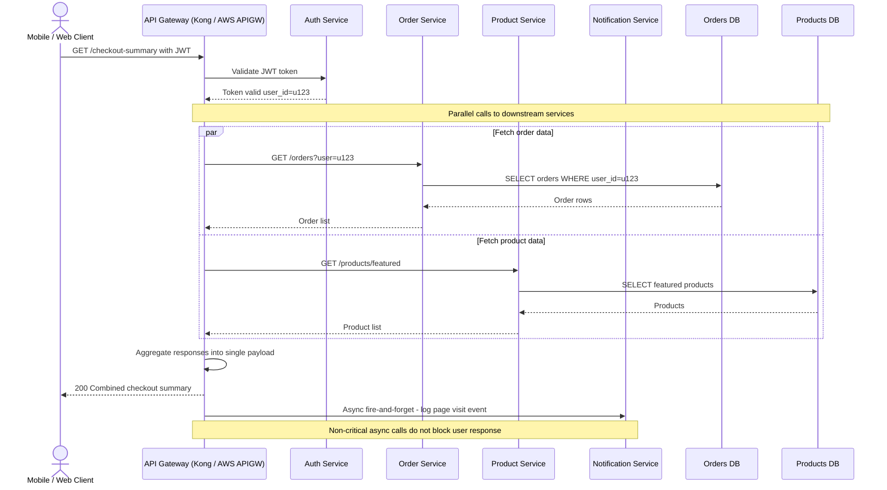

---

## 2. Event-Driven Architecture — SNS Fan-Out to SQS

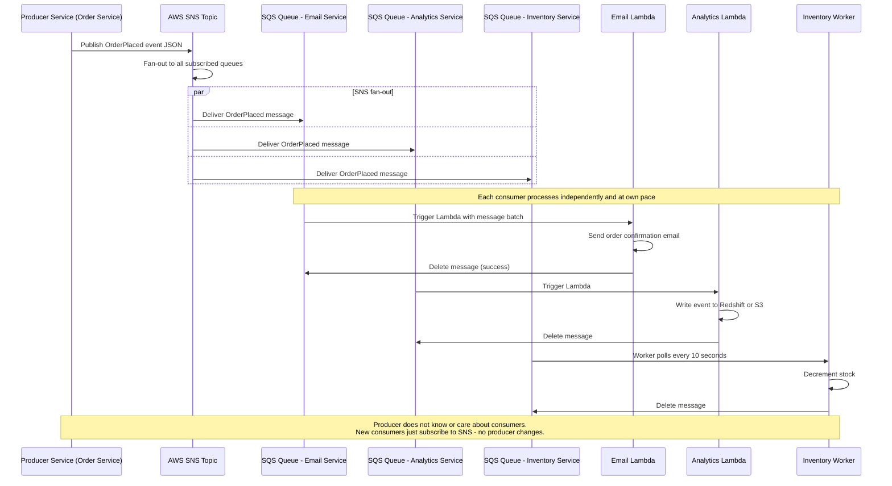

---

## 3. Kafka Producer-Consumer — At-Least-Once Delivery

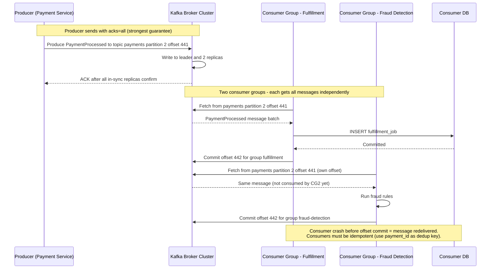

---

## 4. Circuit Breaker Pattern — Closed / Open / Half-Open States

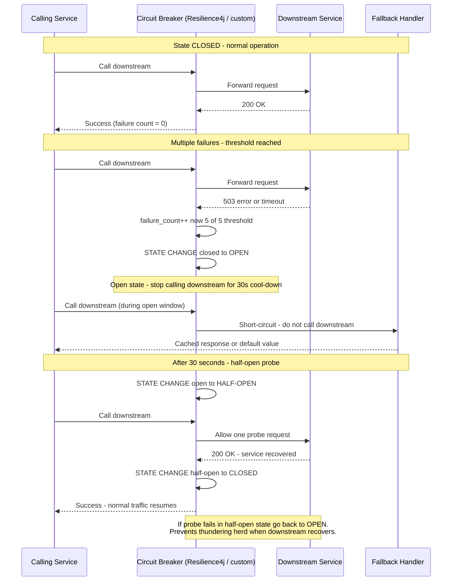

---

## 5. Retry with Exponential Backoff and Jitter

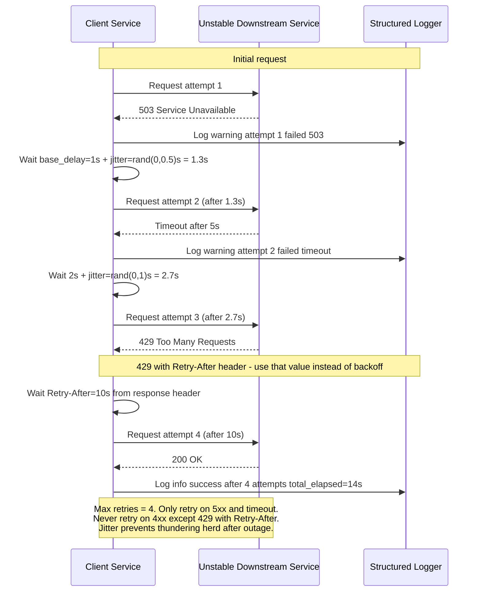

---

## 6. Blue-Green Deployment

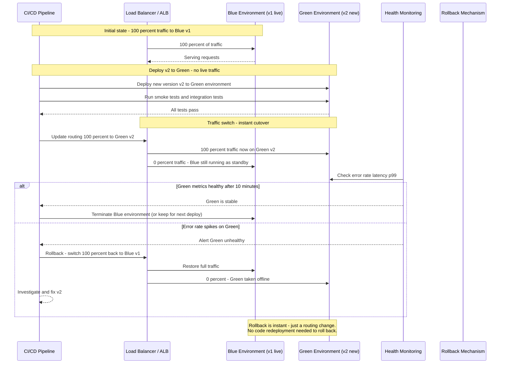

---

## 7. Canary Deployment — Weighted Traffic Routing

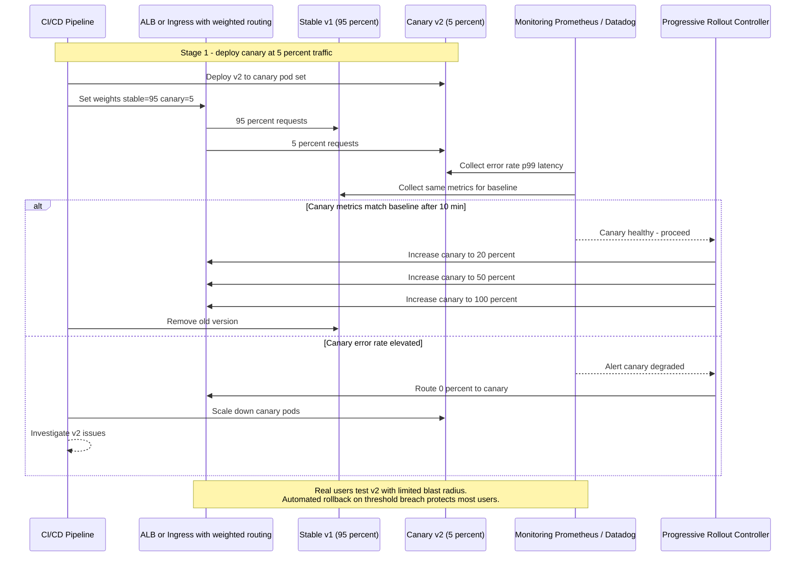

---

## 8. Serverless — Lambda Invocation Patterns

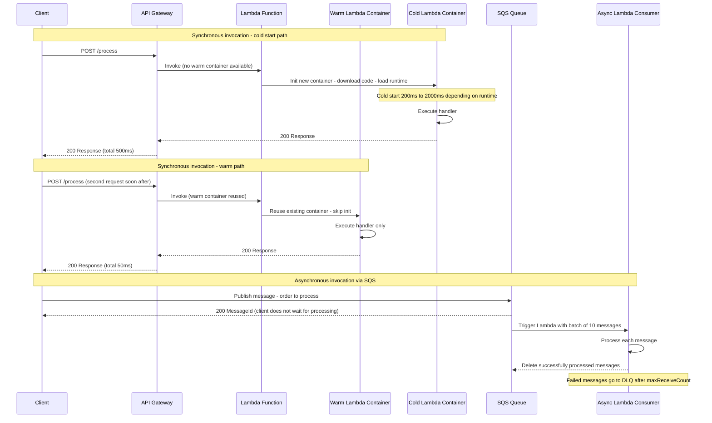

---

## 9. CDN — Cache Flow with Origin Miss and Purge

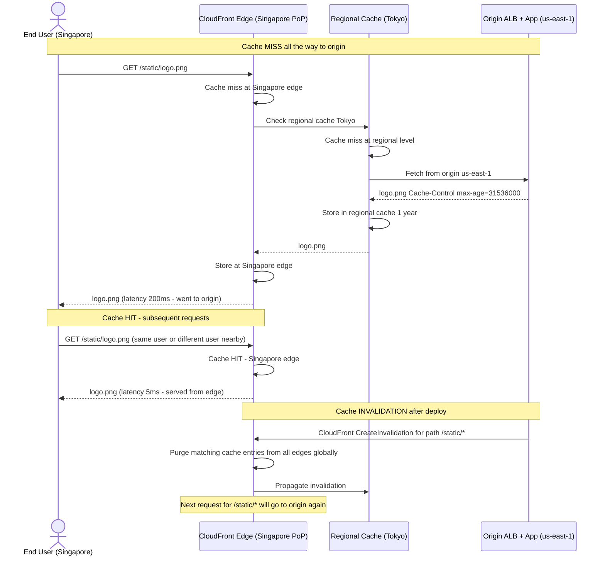

---

## 10. WebSocket — Real-Time Bidirectional Communication

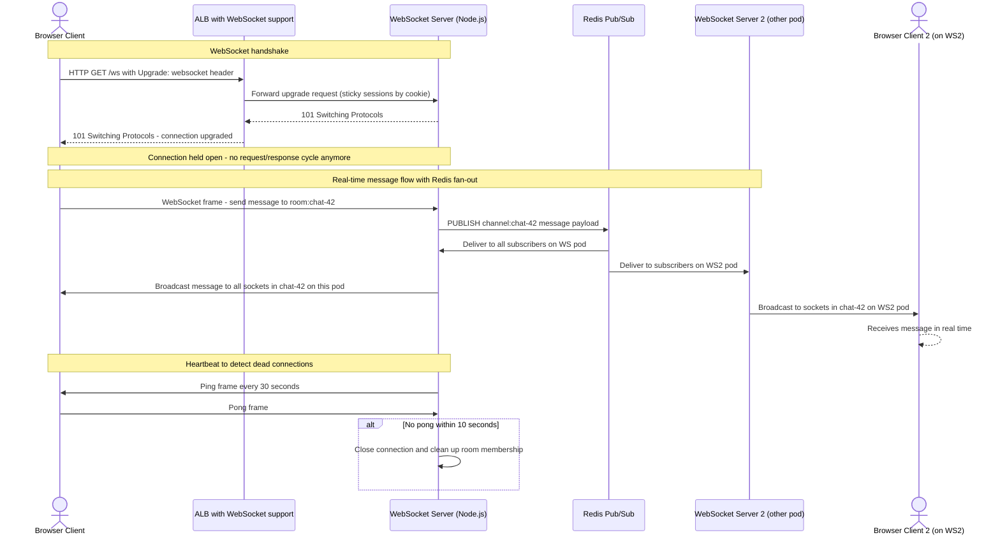

---

## 11. gRPC — Unary and Server Streaming

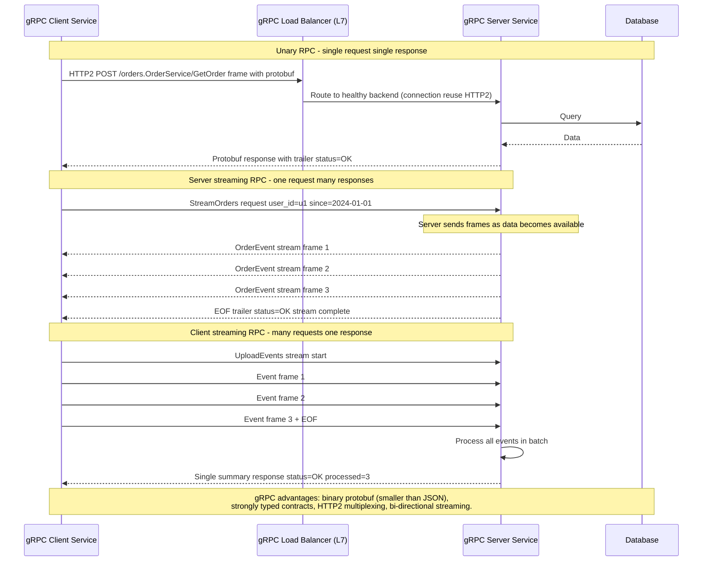

---

## 12. Service Mesh — Istio Sidecar Proxy Flow

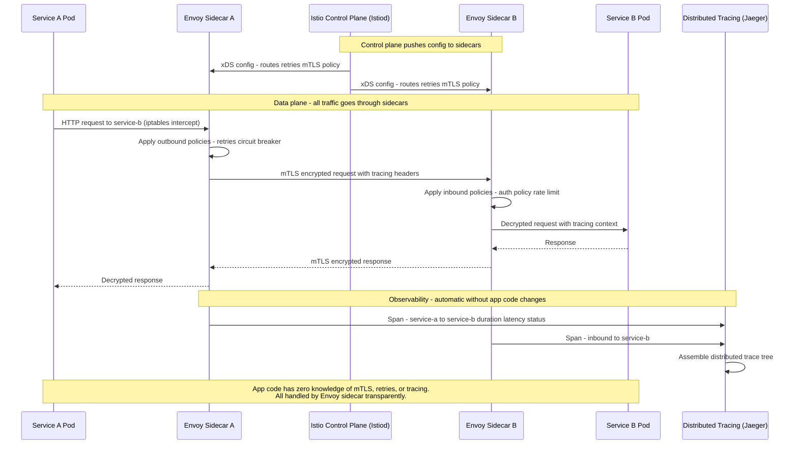

---

## 13. Multi-Region Active-Active Architecture

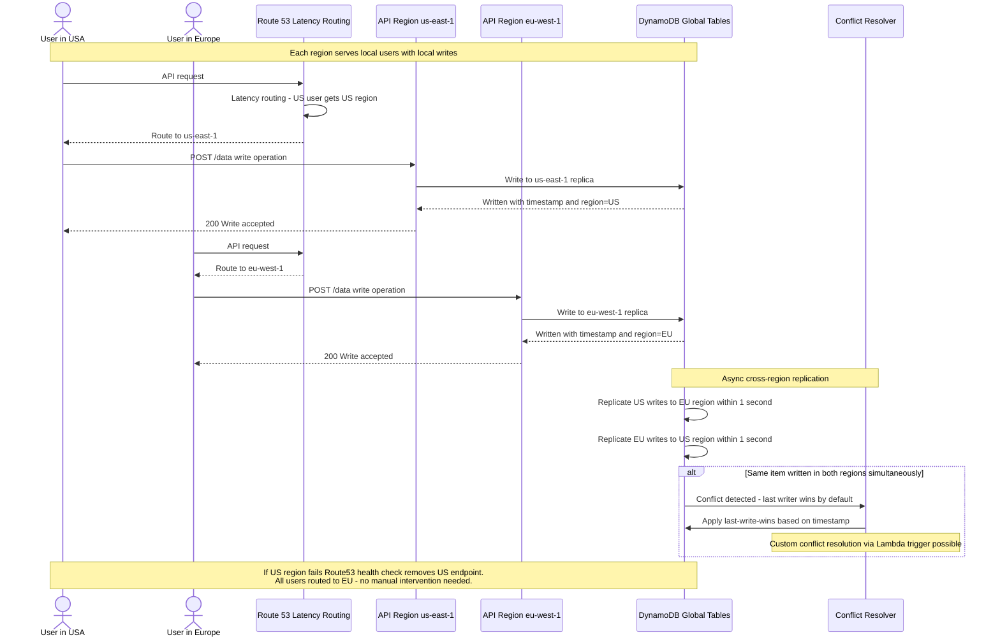

---

## 14. Disaster Recovery — RPO and RTO Planning

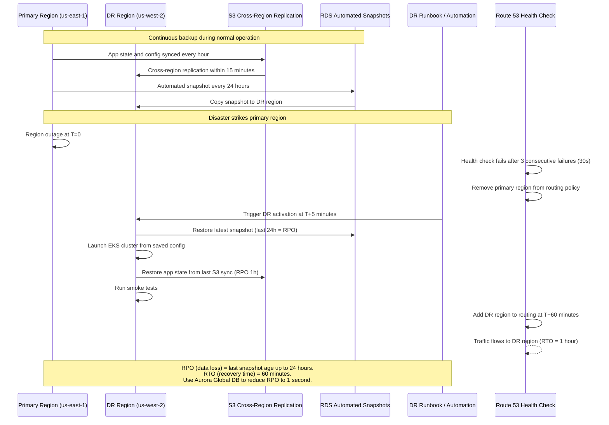

---

## 15. Strangler Fig Migration — Monolith to Microservices

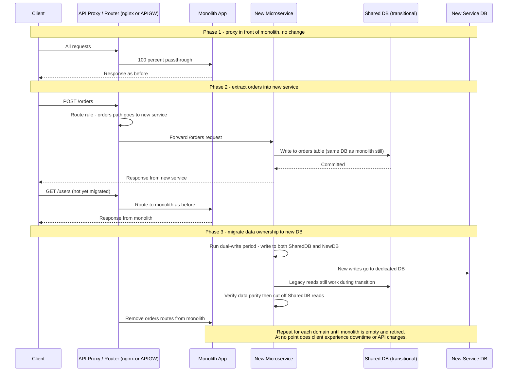

---

## Summary — Architecture Pattern Reference

| Pattern | Problem Solved | Complexity |
|---------|---------------|------------|
| API Gateway fan-out | Single entry, multiple backends, parallel calls | Low |
| SNS + SQS fan-out | One producer, many independent consumers | Low |
| Kafka producer-consumer | High throughput, durable, replayable event stream | Medium |
| Circuit breaker | Cascade failure prevention | Medium |
| Retry with backoff | Transient failure recovery without thundering herd | Low |
| Blue-green deploy | Zero-downtime deploy with instant rollback | Medium |
| Canary deploy | Gradual rollout with automated rollback on metrics | High |
| Lambda cold/warm | Serverless compute with variable latency | Low |
| CDN cache flow | Global edge delivery, reduced origin load | Low |
| WebSocket + Redis pub/sub | Real-time multi-server broadcast | Medium |
| gRPC streaming | Efficient binary RPC with streaming | Medium |
| Istio service mesh | Zero-trust, observability, traffic management without code changes | High |
| Multi-region active-active | Zero-downtime regional failover, global low latency | High |
| Disaster recovery RPO/RTO | Business continuity planning | High |
| Strangler fig migration | Incrementally replace monolith with zero downtime | High |
